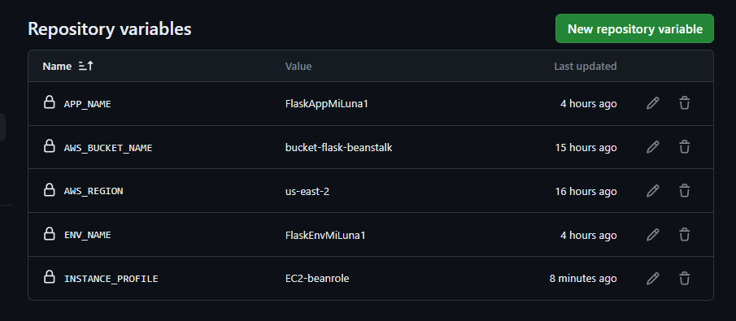
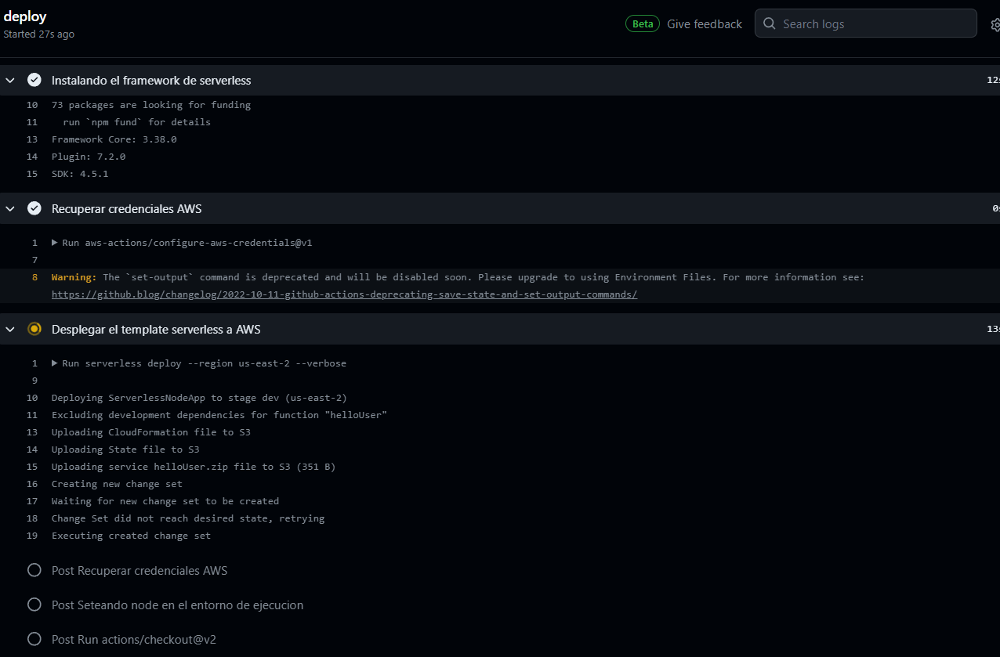
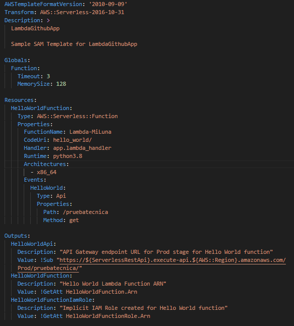
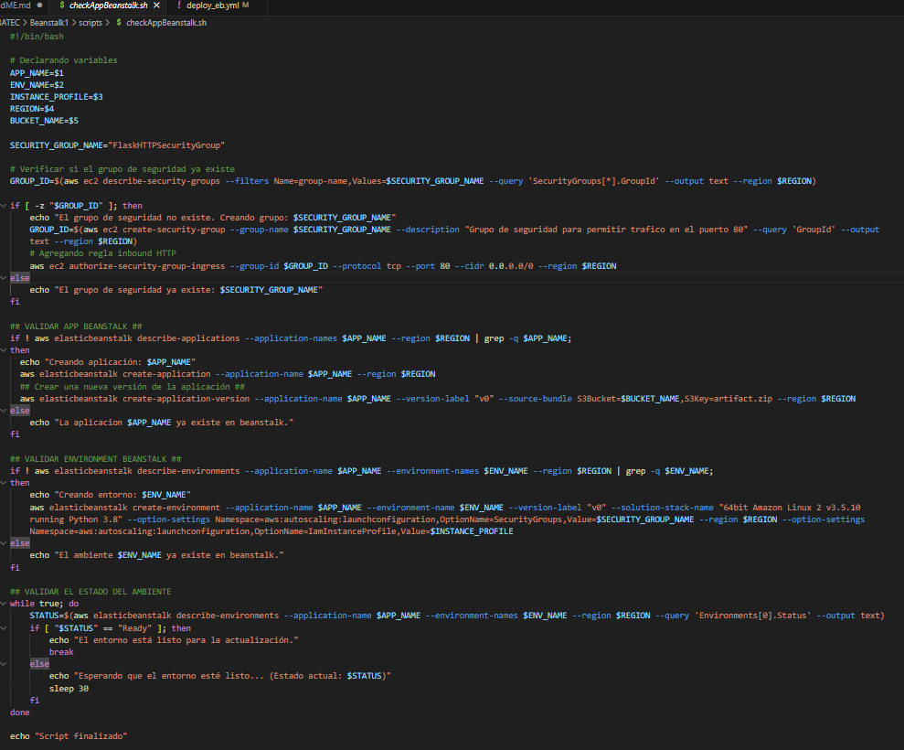

Este repositorio contiene el codigo de una aplicacion web Flask basica, scripts de bash y un pipeline de Github actions para automatizar el despliegue inicial y posteriores actualizaciones de una app Flask en AWS Elastic Beanstalk.

## ARQUITECTURA

## Tecnologías Utilizadas
- AWS Elastic Beanstalk
- GitHub Actions
- Python Flask
- AWS CLI

## REQUISITOS PARA SU EJECUCION:

- AccessKeyID y SecretAccessKeyID de un usuario con los permisos especificados en [GithubUserPolicies](https://github.com/milunadev/EBeanstalk-Flask/blob/main/permisos/githubuser_policies.json). Ambas deben ser declarados como secretos de repositorio en GitHub.

- Definir el nombre 'EC2 Instance profile' como una variable de repositorio con el nombre de INSTANCE_PROFILE. En caso no se tenga un pperfil de instancia, puede crear un rol con la politica gestionada llamada 'AWSElasticBeanstalkWebTier' o usar el formato JSON de esta politica en [beanstalk_ec2_instanceprofile](https://github.com/milunadev/EBeanstalk-Flask/blob/main/permisos/beanstalk_ec2_instanceprofile.json).

- Definir las siguientes variables de repositorio con los valores correspondientes:
.

## PIPELINE GITHUB ACTIONS
El pipeline deploy_eb.yml despliega la aplicacion Flask en una instancia de ElasticBeanstalk cada vez que haya algun push en la rama beanstalkFlask. Algunos pasos que involucra:

0. Copia el repositorio al entorno de ejecución y configura las credenciales de AWS.
1. Se ejecuta un script que valida la existencia del bucket, en caso no exista se crea uno. 
2. Empaqueta la aplicación y sus dependencias en un archivo zip.
3.  Carga el paquete al bucket S3.
4. Se ejecuta un script que valida la existencia de la aplicacion y el ambiente de Beanstalk, en caso no existan los procede a crear.
5. Se crea una nueva version de la app desde el artifact almacenado en S3.
6. Se despliegan los cambios en la aplicacion.

A simple vista 4 y 5-6 pueden parecer redundantes, pero el script del paso 4 solo se ejecutará la primera vez, es decir, cuando no exista la aplicacion o el environment. 
Para las actualizaciones no se creará nada nuevo(el paso 4 solo valida la existencia y pasa al siguiente), solo se actualizará el artifact por lo que el pipeline resulta indempotente y no tendrá problemas al ejecutarse una y otra vez.

## SCRIPTS BASH
- Script para validar la existencia del bucket, caso contrario lo crea.

- Este script tiene las siguientes funciones:
    - Validar y crea en su ausencia un grupo de seguridad que permite el tráfico HTTP hacia la instancia Beanstalk.
    - Validar la existencia de la aplicacion beanstalk, caso contrario crear una aplicacion y una version inicial con el artifact del bucket S3.
    - Valida la existencia del environment, caso contrario crea uno asociado a la version de la aplicacion desplegada un paso atrás. Se agrega un bucle que permite validar el estado del ambiente, pasará al siguiente paso del pipeline cuando este "Ready".

## MEJORAS
- Implementar environments y environment variables y secrets para automatizar el despliegue en diferentes ambientes, aplicando asi la reutilizacion del pipeline.
- Se usa la VPC por defecto