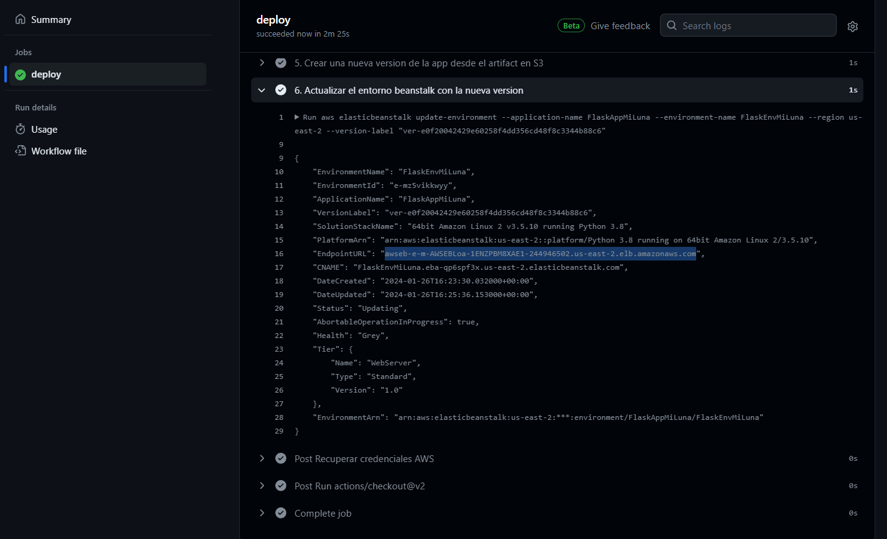
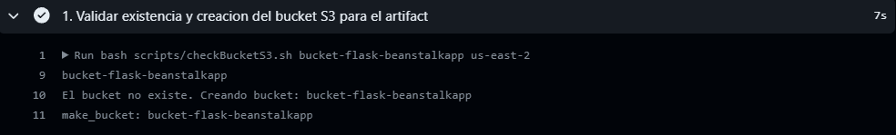

Este repositorio contiene el codigo de una aplicacion Python y todo lo necesario para el despliegue automatico del Lambda que lo correrá, el API gateway para las llamadas y el S3 bucket para almacenar artefactos. Esto se hará a traves de AWS SAM, servicio que facilita el despliegue con IaaC para arquitecturas serverless y con Github Actions para despliegues y actualizaciones automaticas.

## Tecnologías Utilizadas
- AWS Serverless Application Model (SAM)
- GitHub Actions
- Python
- AWS Lambda y API Gateway

## REQUISITOS PARA SU EJECUCION:
- Se hizo uso del ambiente de Github LambdaENV.

- AccessKeyID y SecretAccessKeyID de un usuario con los permisos especificados en [SAMGithubUserPolicies](https://github.com/milunadev/PruebaTecnica_p1/blob/lambdaApiGateway/permisos/githubuser_policies.json). Ambas deben ser declaradas como secretos de ambiente en el environment LambdaENV.

- Definir las siguientes variables de repositorio con los valores correspondientes:

## SAM TEMPLATE
El template SAM define la infraestructura serverless que se despliega a través de AWS CloudFormation. En la sección de recursos definimos que se creará una funcion Lambda llamada "Lambda-MiLuna", definimos tambien la ubicacion donde se halla la funcion, el runtime, el metodo que se llamará y un evento HTTP GET, que representa la API gateway que se creará.
Importante tambien definir los outputs para obtener de forma rapida el endpoint de consulta.

## GITHUB ACTIONS
Este pipeline automatiza el despliegue de una función Lambda y una API Gateway en AWS, activándose con cada push a la rama lambdaApiGateway. Realiza los siguientes pasos:
- Checkout del código y configuración de entorno con SAM y Python.
- Configura credenciales
- Prepara el bucket S3, a traves de un script de bash validamos la existencia por temas de idempotencia antes de crearlo. Solo se crea si no existe previamente el bucket.
- Finalmente se realiza la construcción y despliegue mediante sam build y sam deploy.

# SCRIPTS
- Para automatizar el proceso lo mas que se pueda se realizó un script que permite crear un bucket con un nombre personalizado, ya que es donde se almacenará el artifact producto de la construcción de la aplicación. Siempre se valida la existencia previa antes de la creación para evitar conflictos.

## MEJORAS
- Evaluar a detalle que permisos son requeridos explicitamente por la plantilla SAM dependiendo de los recursos que se creen para aplicar el principio de minimo privilegio.
- Implementar una etapa de testing unitario antes del despliegue a través Github Actions.
- Implementar una etapa post-despliegue que comunique la finalización y estado del pipeline a los desarrolladores que realizaron el push.