# PIPELINE DE GITHUB ACTIONS PARA DESPLIEGUE AUTOMATICO DE UNA APLICACION BEANSTALK.
Este repositorio contiene el codigo de una aplicacion web Flask basica, scripts de bash y un pipeline de Github actions para automatizar el despliegue inicial y posteriores actualizaciones de una app Flask en AWS Elastic Beanstalk.

## ARQUITECTURA
Beanstalk es un servicio ideal si nos queremos enfocar en el desarrollo y despliegue del codigo y no demasiado por la infraestructura. Se encarga de desplegar todo lo necesario, desde instancias, balanceador de carga, target groups, lister rules, grupo de autoscaling, etc.
Además proporciona funcionalidades de rollback automatico, diferentes estrategias de despliege que lo hacen una herramienta excelente para esta tarea.
Adicionalmente usamos un bucket S3 para subir los artifacts producto de la construcción de Github Actions.
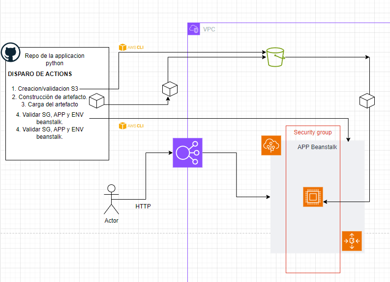

## Tecnologías Utilizadas
- AWS Elastic Beanstalk
- GitHub Actions
- Python Flask
- AWS CLI

## REQUISITOS PARA SU EJECUCION:

- AccessKeyID y SecretAccessKeyID de un usuario con los permisos especificados en [GithubUserPolicies](https://github.com/milunadev/PruebaTecnica_p1/blob/beanstalkFlask/permisos/githubuser_policies.json). Ambas deben ser declarados como secretos de ambiente en GITHUB.

- Definir el nombre 'EC2 Instance profile' como una variable de repositorio con el nombre de INSTANCE_PROFILE. En caso no se tenga un pperfil de instancia, puede crear un rol con la politica gestionada llamada 'AWSElasticBeanstalkWebTier' o usar el formato JSON de esta politica en [beanstalk_ec2_instanceprofile](https://github.com/milunadev/PruebaTecnica_p1/blob/beanstalkFlask/permisos/beanstalk_ec2_instanceprofile.json).

- Definir las siguientes variables de repositorio con los valores correspondientes:
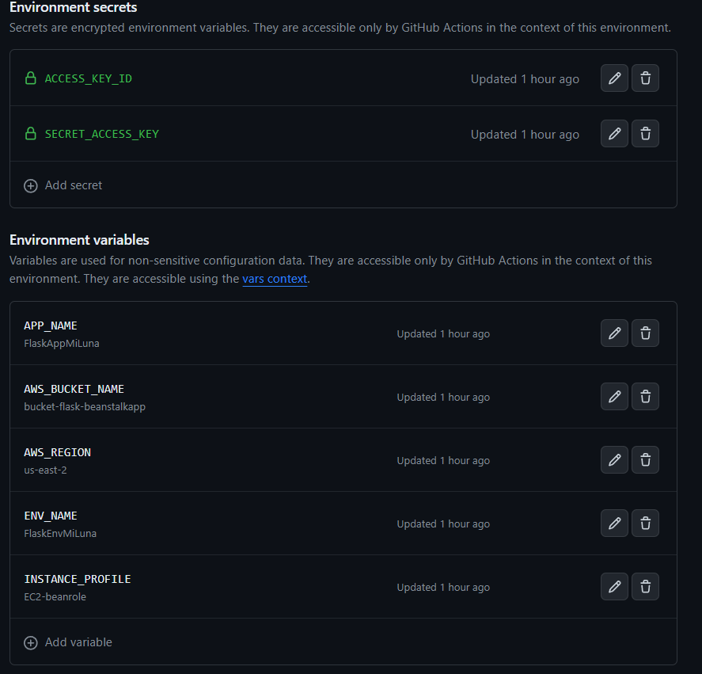

## PIPELINE GITHUB ACTIONS
El pipeline deploy_eb.yml despliega la aplicacion Flask en una instancia de ElasticBeanstalk cada vez que haya algun push en la rama beanstalkFlask. Algunos pasos que involucra:

0. Copia el repositorio al entorno de ejecución y configura las credenciales de AWS.
1. Se ejecuta un script que valida la existencia del bucket, en caso no exista se crea uno. 
2. Empaqueta la aplicación y sus dependencias en un archivo zip.
3.  Carga el paquete al bucket S3.
4. Se ejecuta un script que valida la existencia de la aplicacion y el ambiente de Beanstalk, en caso no existan los procede a crear.
5. Se crea una nueva version de la app desde el artifact almacenado en S3.
6. Se despliegan los cambios en la aplicacion.

A simple vista 4 y 5-6 pueden parecer redundantes, pero el script del paso 4 solo se ejecutará la primera vez, es decir, cuando no exista la aplicacion o el environment. 
Para las actualizaciones no se creará nada nuevo(el paso 4 solo valida la existencia y pasa al siguiente), solo se actualizará el artifact por lo que el pipeline resulta indempotente y no tendrá problemas al ejecutarse una y otra vez.

## SCRIPTS BASH
- Script para validar la existencia del bucket, caso contrario lo crea.

- Este script tiene las siguientes funciones:
    - Validar y crea en su ausencia un grupo de seguridad que permite el tráfico HTTP hacia la instancia Beanstalk.
    - Validar la existencia de la aplicacion beanstalk, caso contrario crear una aplicacion y una version inicial con el artifact del bucket S3.
    - Valida la existencia del environment, caso contrario crea uno asociado a la version de la aplicacion desplegada un paso atrás. Se agrega un bucle que permite validar el estado del ambiente, pasará al siguiente paso del pipeline cuando este "Ready".

## VALIDACION
1. Cuando todo se crea por primera vez:
    - Validacion/creacion S3.
        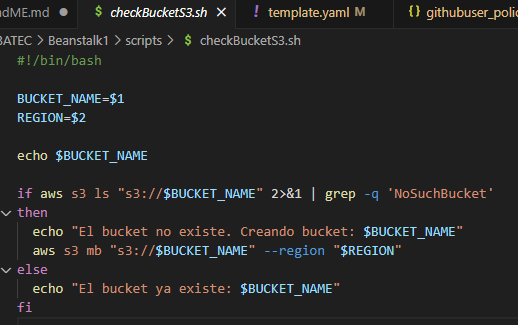
    - Crear y carga el artifact, siempre se ejecuta.
        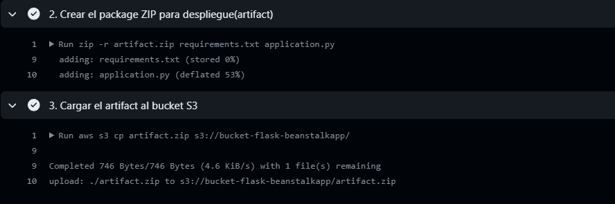
    - Validacion del SG, APP beanstalk y env. Crea todo, toma 2m 11s.
        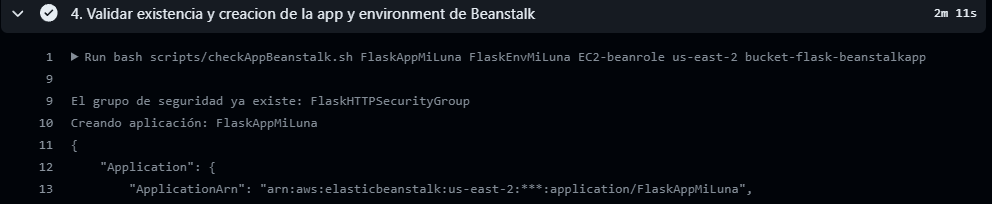
        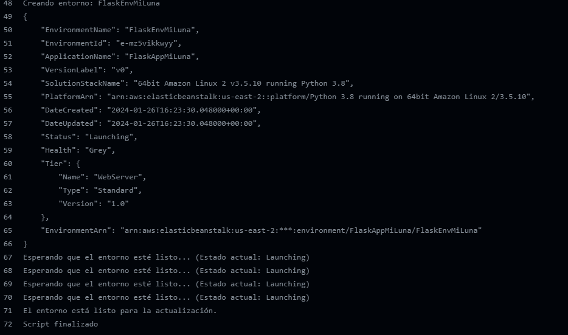
    - Creacion de la version y despliegue.
        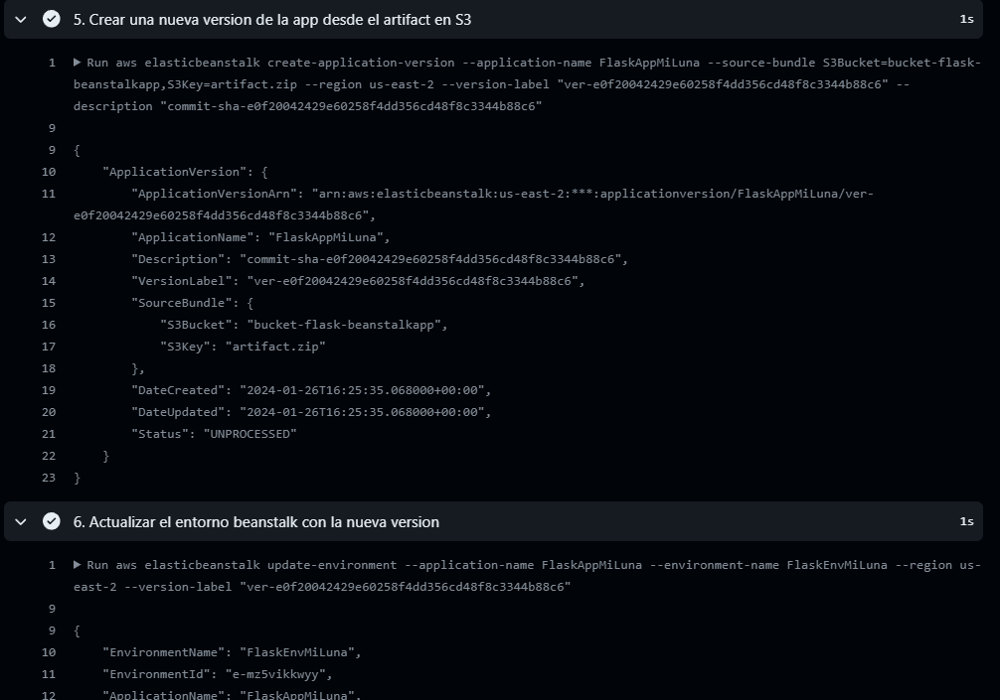
    
    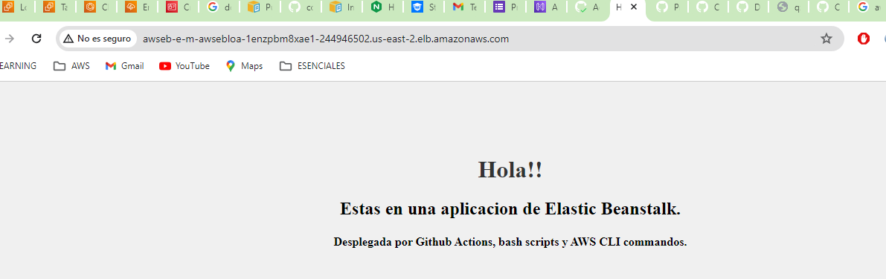

2. Cuando solo se actualiza el código: 
    - Validacion del bucket, crear y carga el artifact.
        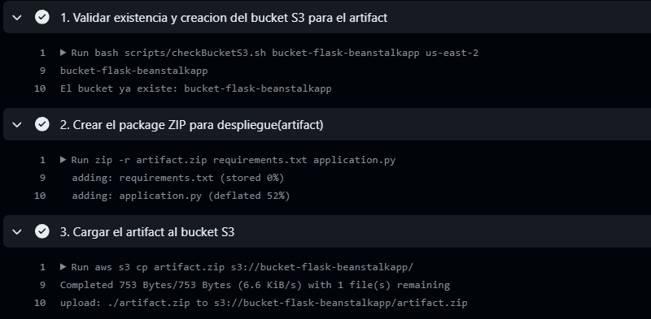
    - Validacion del SG, beanstalk y env. Solo valida, no crea, toma 3s.
        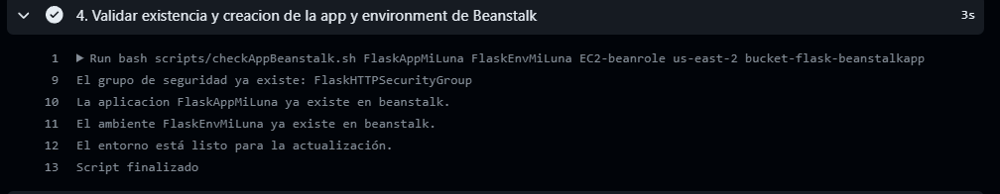
    - Creacion de la version y despliegue.
        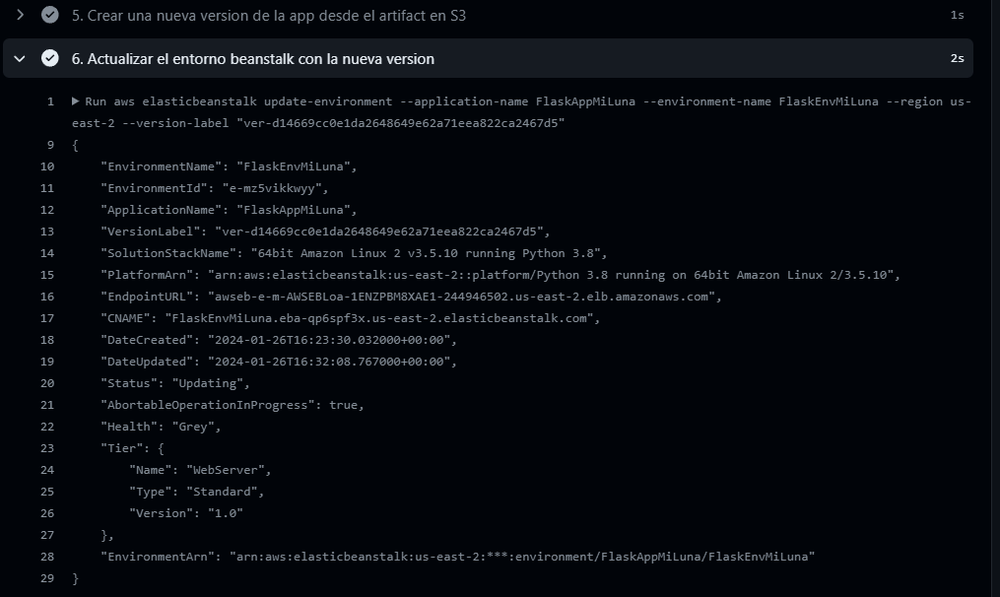
    
    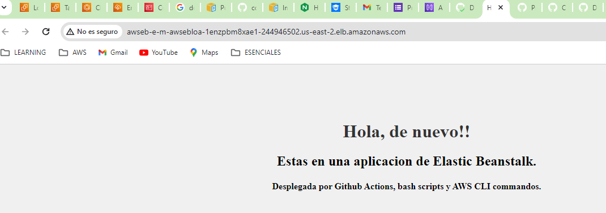

Al final recibimos los parametros de la aplicacion beanstalk, nos interesa probar el endpointURL: http://awseb-e-m-awsebloa-1enzpbm8xae1-244946502.us-east-2.elb.amazonaws.com/ 

## MEJORAS
- En el futuro se podria implementar una plantilla de IaaC (Cloudformation o Terraform) que puede ser ejecutado por el pipeline, asi mejoramos la consistencia y reusabilidad.
- Se debe considerar el uso de Route53 para asociar un dominio a la aplicación.
- Se deben implementar etapas de testing en el pipeline de actions.
- Se deben configurar rollbacks automaticas para minimizar el impacto.
- Considerar previa evaluación la mejor estrategia de despliegue (canary, all-at-once, blue/green), segun el entorno (dev, prod) y los costos asociados.
- Se deben implementar alertas de Cloudwatch y una estrategia de monitoreo.
