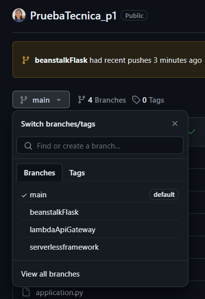

Este repositorio contiene el codigo JS de un Lambda que será desplegado mediante el framework Serverless en conjunto con una API Gateway que permite su acceso desde Internet.

## ARQUITECTURA:

## TECNOLOGIAS USADAS:
- Serverless Framework
- GitHub Actions
- Node.js
- Lambda y API Gateway

## REQUISITOS PARA SU EJECUCION:

- Se hizo uso del ambiente de Github ServerlessENV, donde se declararon los siguientes secretos y variables de ambiente.

- AccessKeyID y SecretAccessKeyID de un usuario con los permisos especificados a continuación. Ambas deben ser declarados como secretos de ambiente en GitHub.
    - AmazonAPIGatewayAdministrator
    - AmazonS3FullAccess
    - AWSCloudFormationFullAccess
    - AWSLambda_FullAccess
    - CloudWatchLogsFullAccess

## SERVERLESS TEMPLATE:
Optamos por una plantilla con un solo servicio llamado "ServerlessNodeApp", el cual usa el runtime Node.js v18.
El servicio permite crear una funcion Lambda llamada helloUser, que al ser llamada mediante el API HTTP devolverá el mensaje "Hola! Este es el resultado de la prueba tecnica -> 10/10 :D".

Cuando se despliega este servicio, Serverless Framework crea automáticamente una función AWS Lambda con una API Gateway. Esto permite que la función helloUser ubicada en [handler.js](https://github.com/milunadev/PruebaTecnica_p1/blob/serverlessframework/aplicacion/handler.js) sea invocada a través de una solicitud HTTP GET en la ruta especificada.

## PIPELINE DE GITHUBACTIONS:
Este pipeline de GitHub Actions, nombrado deployServerlessFramework, automatiza el proceso de despliegue de una aplicación configurada con el Serverless Framework en AWS, incluyendo:
    - Inicia la ejecución cuando haya push a la rama serverlessframework, que es donde se encuentra el proyecto.
    - Configuracion del entorno de ejecución instalando el framework, NodeJS en la version 18.
    - Gestión de credenciales para creación de recursos.
    - Despliegue de la plantilla con flag verbose que permite ver el proceso y los resultados del pipeline.

## EJECUCION

## MEJORAS
- Evaluar a detalle que permisos son requeridos explicitamente por el framework de serverless para aplicar el principio de minimo privilegio, por ahora se abrieron permisos full a servicios involucrados como ApiGateway, S3 para almacenar el artifact, Lambda, Cloudwatch y CloudFormation.